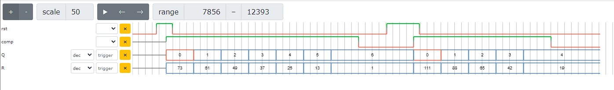

# Division Example

This example does some basic integer division based on repeat subtraction with no special handling for stuff like
divide by zero, etc. This was mostly an exercise in learning how to connect registers with wires between the division
module and the test bench module.

## Division Module

The `division` module takes a `clk` and `rst` input and provides a `comp` output for control purposes. The actual values
the function uses to compute division are the numerator `N`, denominator `D`, the quotient `Q` and the remainder `R`.

`Q` and `R` are wires in the test bench and registers in the `division` module whereas `N` and `D` are registers in the
test bench and inputs in the module. The `tb` module can write to the `clk`, `rst`, `N`, and `D` registers to send which
the `division` module reads in, computes on and updates the `Q` and `R` registers before finally setting the `comp`
register to 0, signaling the division is complete to the `tb` module.

The example `tb` sets the `N`, `D`, and `rst`, registers. The `division` module sees this change on the first cycle and
sets initial values for `Q` and `R` as well as setting the `comp` register. The next cycle the `tb` module unsets the
`rst` register allowing the `division` module to begin subtracting the denominator from the remainder while incrementing
the quotient. Once the remainder `R` is less than the denominator `D`, the `comp` register is reset and the `Q` and
`R` registers will reflect the result of the division.

Above diagram was generated by [Yosys verilog visualizer/simulator](http://digitaljs.tilk.eu/).