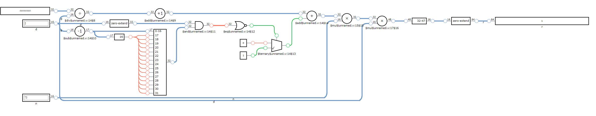
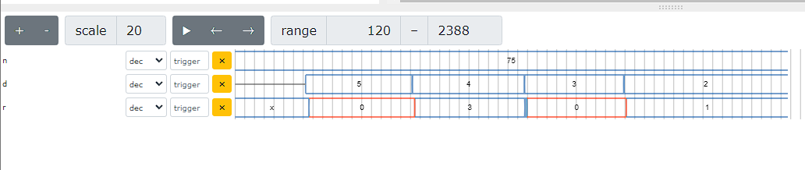

# Fast Mod Example

This is just a direct implementation of the below referenced fastmod algorithm. Was my exploration into algorithms which
do not depend on sequential logic. Just set the `n` and `d` registers with desired numerators or denominators and the
`r` register will reflect the remainder. This can be used for divisibility as well simply by checking if the remainder
is 0 or not.

## References

- [Faster remainders when the divisor is a constant: beating compilers and libdivide](https://lemire.me/blog/2019/02/08/faster-remainders-when-the-divisor-is-a-constant-beating-compilers-and-libdivide/)
- [Faster Remainder by Direct Computation Applications to Compilers and Software Libraries](https://arxiv.org/pdf/1902.01961.pdf)